# SEIM architecture

This document describes the architecture implemented in `seim-core` v1.0.6. It is intentionally a code-level description, not a claim that SEIM can replace every engineering specialty without project-specific policy, tests, credentials, and human ownership.

SEIM has two complementary evolution planes:

1. The runtime plane observes a running Node.js application, detects route and behavior signals, evaluates bounded candidates, and can route or roll back supported Express handlers.
2. The repository plane takes over an existing baseline repository, indexes its React/Next and backend context, converts issues or product goals into governed tasks, verifies changes in a disposable workspace, and publishes GitHub pull requests. Generated GitHub Actions workflows deliver verified commits to Vercel or AWS ECS.

## System context

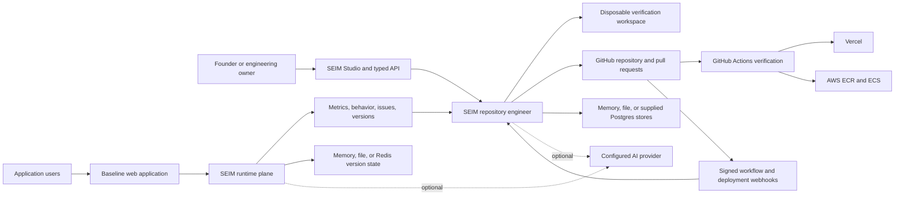

The application remains the execution boundary. SEIM does not own the application's database, cloud account, GitHub organization, or production policy. Those remain external systems controlled by the operator.

## Component map

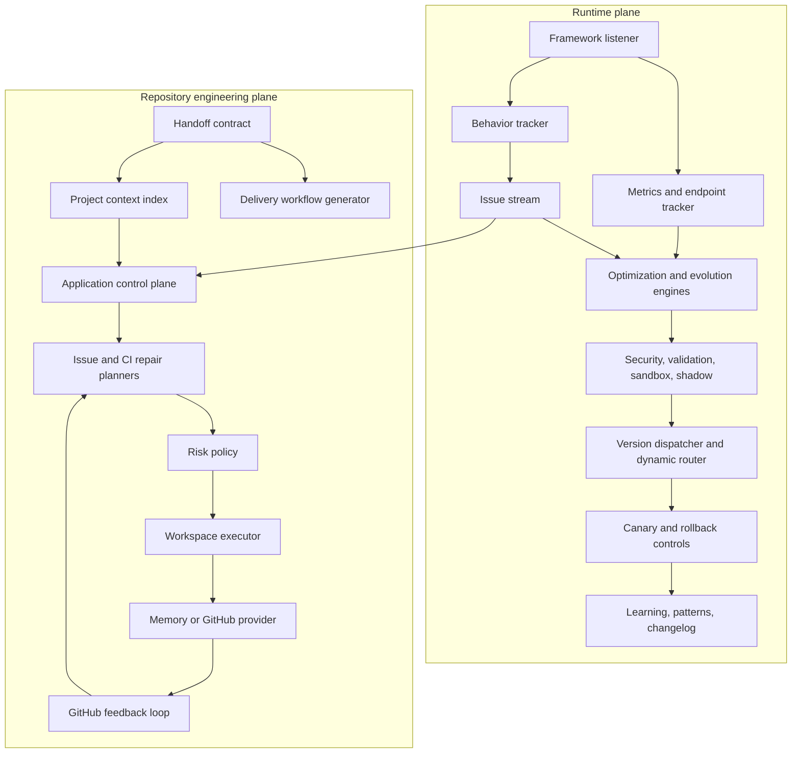

## Runtime request flow

The Express listener is the most complete runtime integration. It records telemetry, permits a dynamically registered route to answer first, and otherwise delegates to the existing application. Fastify and generic adapters provide integration and observability, but the current package does not provide equivalent live handler replacement for every framework.

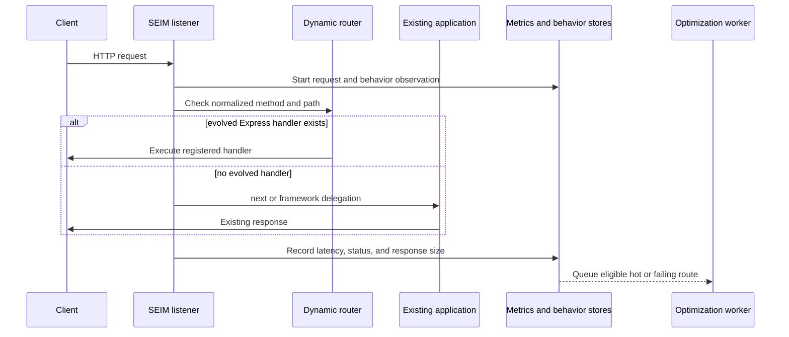

Request interception is not the same as repository evolution. A runtime optimization may affect an in-process route; a repository change must still pass the engineering workflow before it becomes source code.

## Runtime candidate lifecycle

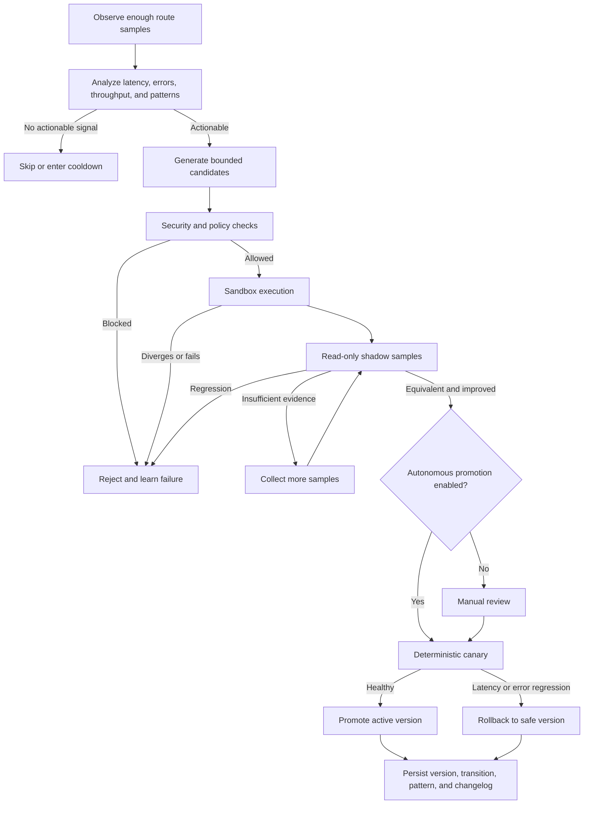

Shadow execution defaults to safe HTTP methods. It marks cloned requests with `isShadow` and `x-seim-shadow`; application integrations must use those signals to suppress external side effects. This marker is a contract, not a transaction boundary around third-party systems.

## Behavior-driven product issue flow

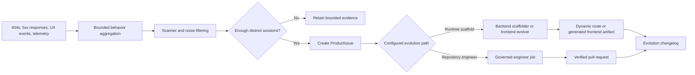

`feature:missing_api` and `feature:missing_page` have concrete planners. Unsupported goals remain visible as manual review/test tasks instead of being silently invented.

## Application handoff and context indexing

The takeover boundary is `.seim/handoff.json`. It records ownership paths, project commands, delivery targets, autonomy, protected paths, and approval-required paths.

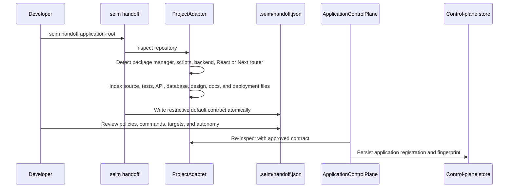

The index is bounded to 5,000 discovered files and marks itself as truncated when that limit is reached. It indexes metadata and selected paths; it is not a semantic understanding of every line in a large repository.

## Goal-to-task control flow

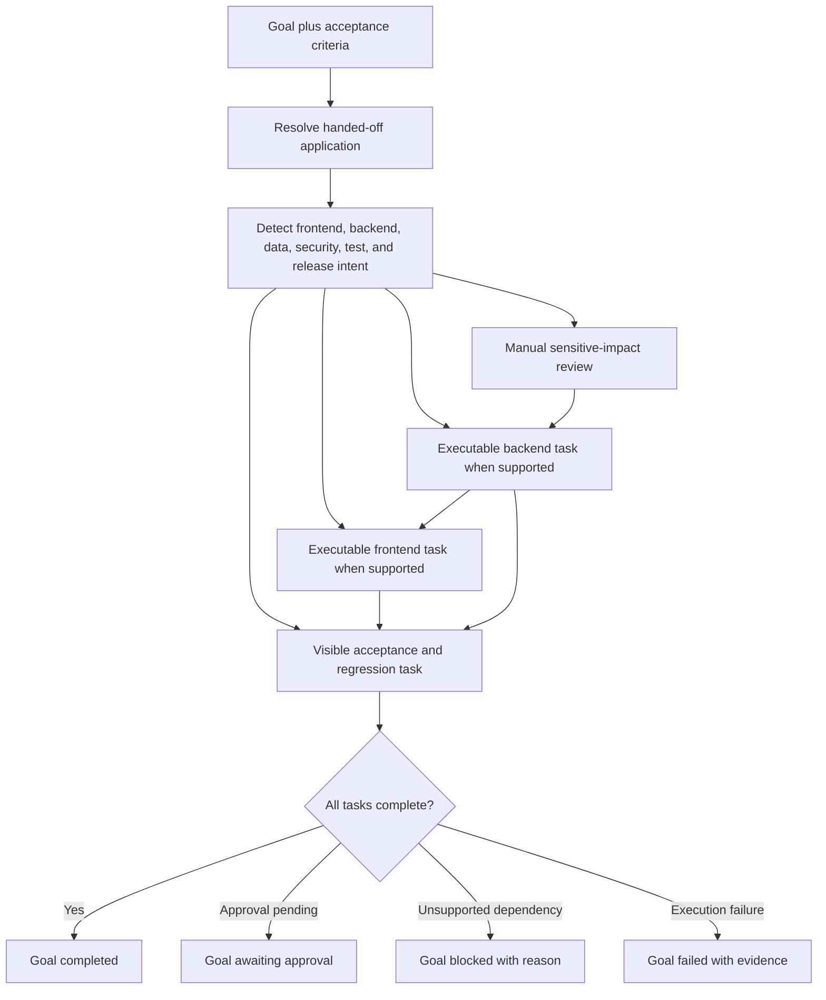

The current control plane decomposes goals deterministically from goal text and the project manifest. It does not yet provide a general-purpose autonomous product manager for arbitrary requirements.

## Engineer job state machine

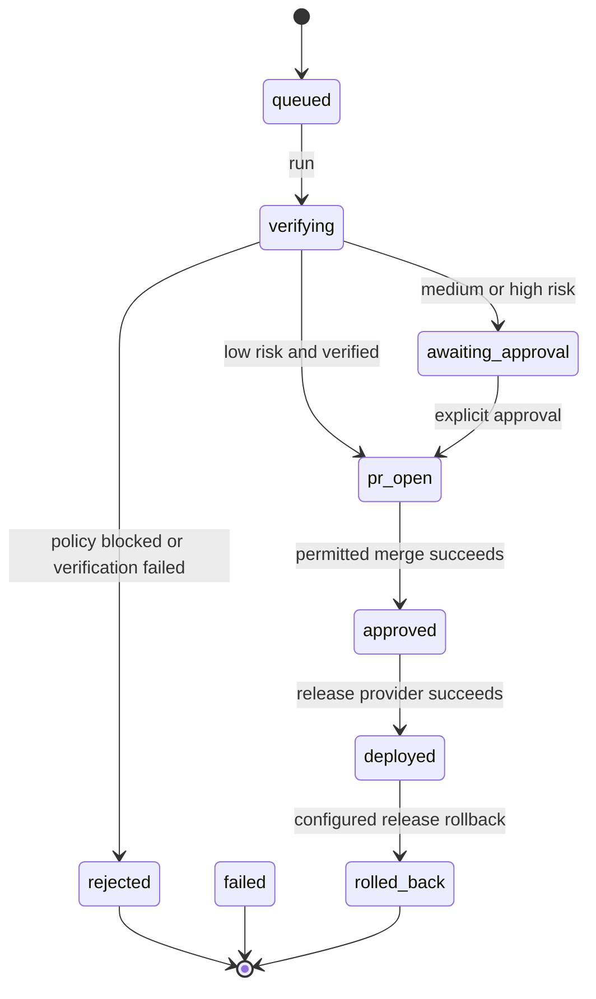

The `planning` status exists in the type model, but current `submit()` creates the plan before persisting the queued job. The normal persisted path is therefore `queued -> verifying`.

## Change planning, risk, and verification

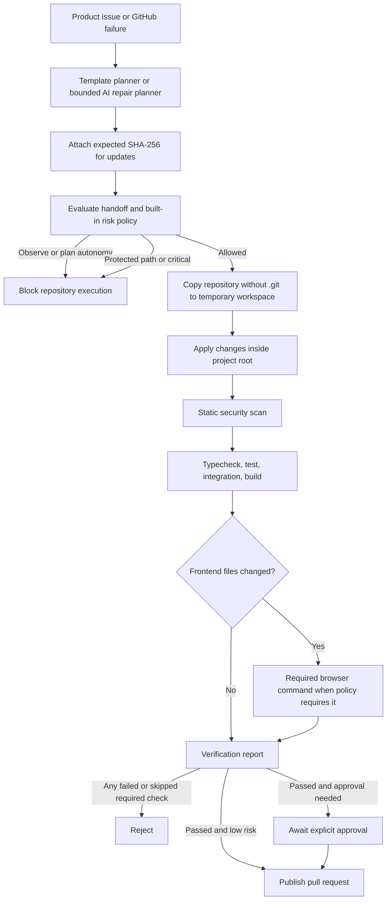

The disposable workspace is process-level isolation. Commands execute on the host with secret-like environment variables removed; this is not a hardened container, microVM, or hostile-code sandbox. Production operators should run the engineer worker in an externally isolated container or VM with least-privilege credentials.

Before verification, SEIM rejects symbolic links in the application tree and validates every planned write path. This prevents lexical path checks from being bypassed through filesystem links; it does not replace OS-level worker isolation.

## React and Next.js change planning

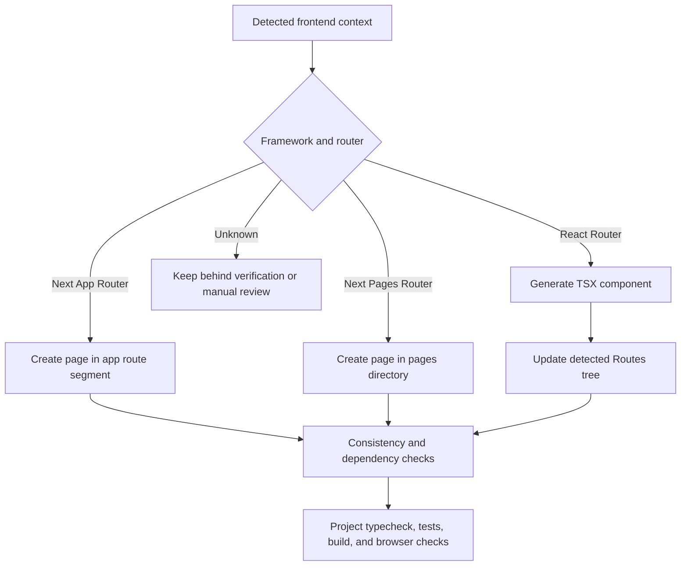

The context includes detected dependencies, styling libraries, state libraries, data libraries, known routes, entrypoints, and router kind. Generation reuses that context, but visual quality and business correctness still depend on acceptance criteria and project tests.

## GitHub publication flow

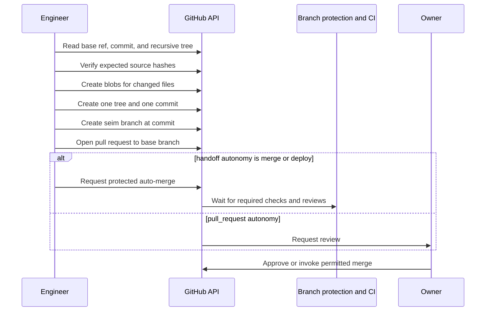

Authentication supports a static token or a GitHub App installation token provider. GitHub App mode signs a short-lived JWT and caches the short-lived installation token. Branch protection remains the authoritative merge gate.

## GitHub failure and repair loop

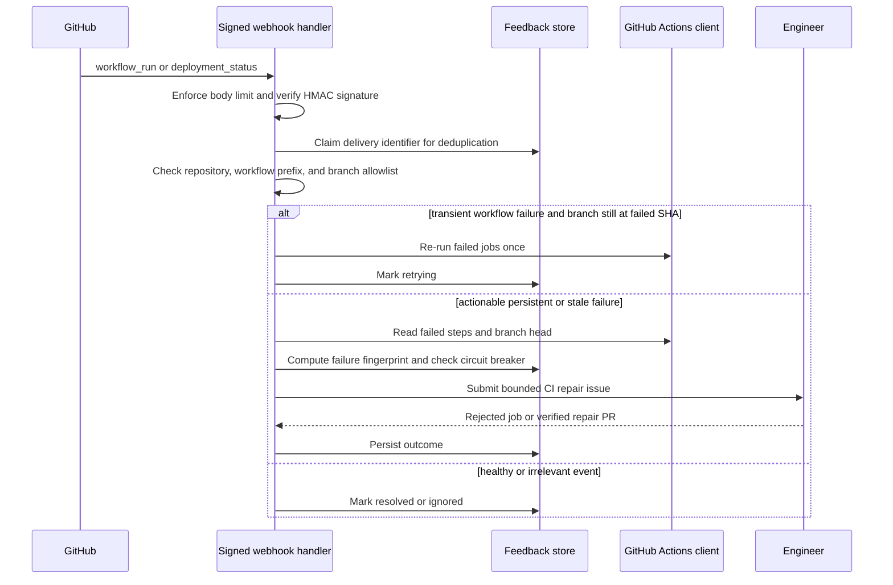

The default circuit breaker allows at most two prior equivalent repair attempts per fingerprint. The loop only acts on configured repositories, branches, and SEIM workflow names or paths.

## Vercel delivery flow

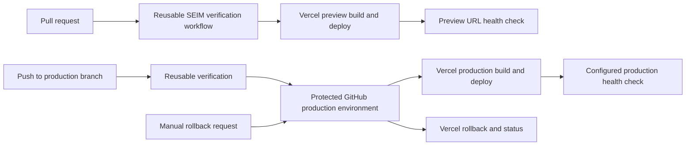

Required GitHub configuration: secret `VERCEL_TOKEN`; variables `VERCEL_ORG_ID` and `VERCEL_PROJECT_ID`. The workflows use provider CLIs at execution time, so pinning and organization policy should be reviewed before production use.

## AWS ECS delivery flow

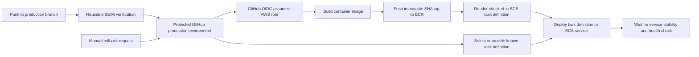

Required GitHub variables: `AWS_ROLE_ARN`, `AWS_REGION`, `AWS_ECR_REPOSITORY`, `AWS_ECS_CLUSTER`, `AWS_ECS_SERVICE`, and optional `AWS_HEALTHCHECK_URL`. AWS access keys are not generated; OIDC and a least-privilege role are required.

## Persistence ownership

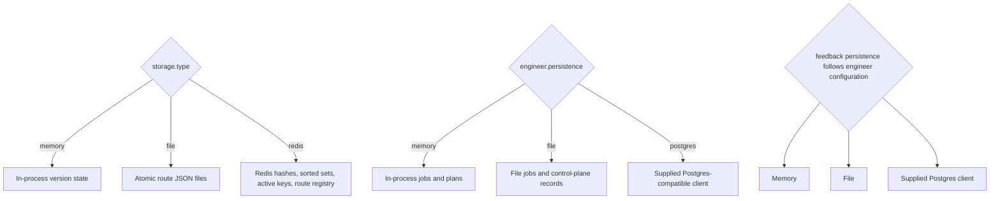

| State | Memory | File | Redis/Postgres |
|---|---|---|---|
| Endpoint versions, transitions, active version | Yes | Yes | Redis |
| Runtime metrics | Yes | No | No |
| Candidate and artifact stores | Yes | Yes | File-backed when runtime storage is Redis |
| Learning patterns and changelog | Yes | Yes | File-backed when runtime storage is Redis |
| Engineer jobs and plans | Yes | Yes | Supplied Postgres client |
| GitHub feedback records | Yes | Yes | Supplied Postgres client |

Redis therefore shares endpoint version state across processes without whole-array lost updates. It is not a distributed transaction coordinator, and it does not currently centralize every runtime metric, candidate, artifact, or learning store. File storage is suitable for a single writer on durable local storage, not multiple replicas sharing a network filesystem.

## Security and trust boundaries

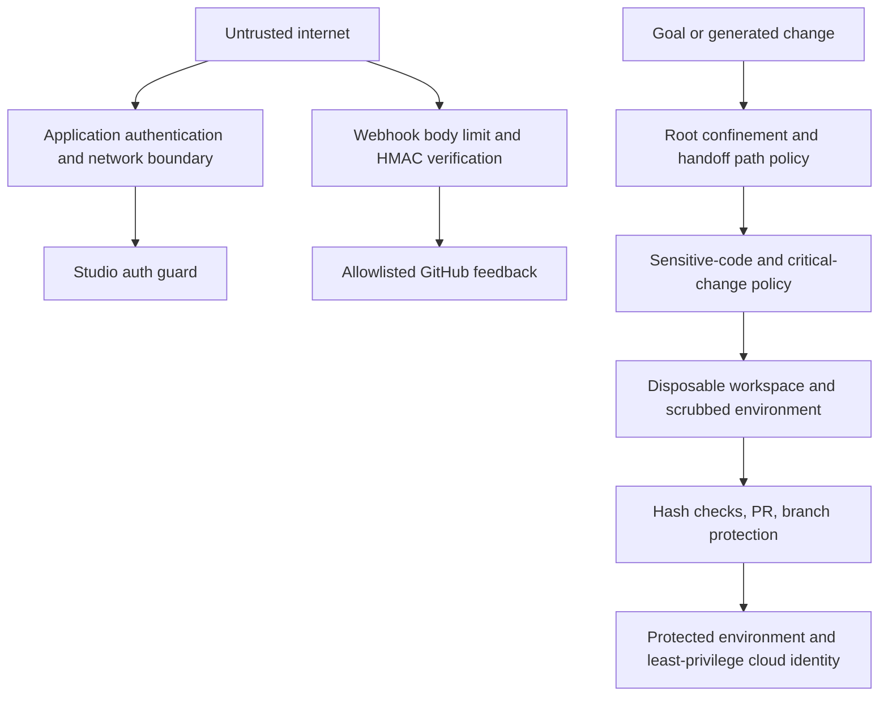

Security invariants implemented in code include repository-root confinement, protected paths, approval paths, sensitive-code checks, stale-source hash refusal, signed webhook verification, delivery deduplication, branch/workflow allowlists, bounded webhook bodies, secret-like environment scrubbing for verification commands, and production rejection of volatile runtime storage.

These controls do not replace application authorization, dependency scanning, cloud IAM review, code-owner review, a hardened worker sandbox, or security testing.

## Autonomy levels

| Handoff autonomy | Observe/index | Plan goals | Verify changes | Open PR | Merge | Deploy |
|---|---:|---:|---:|---:|---:|---:|
| `observe` | Yes | Yes | No | No | No | No |
| `plan` | Yes | Yes | No | No | No | No |
| `pull_request` | Yes | Yes | Yes | Yes | No | No |
| `merge` | Yes | Yes | Yes | Yes | Through GitHub policy | No direct release provider by default |
| `deploy` | Yes | Yes | Yes | Yes | Through GitHub policy | Through generated workflows or configured release provider |

Risk policy can reduce autonomy but cannot expand it. Critical changes and protected paths remain blocked. Medium and high-risk allowed changes wait for explicit approval before publication.

## Startup and shutdown

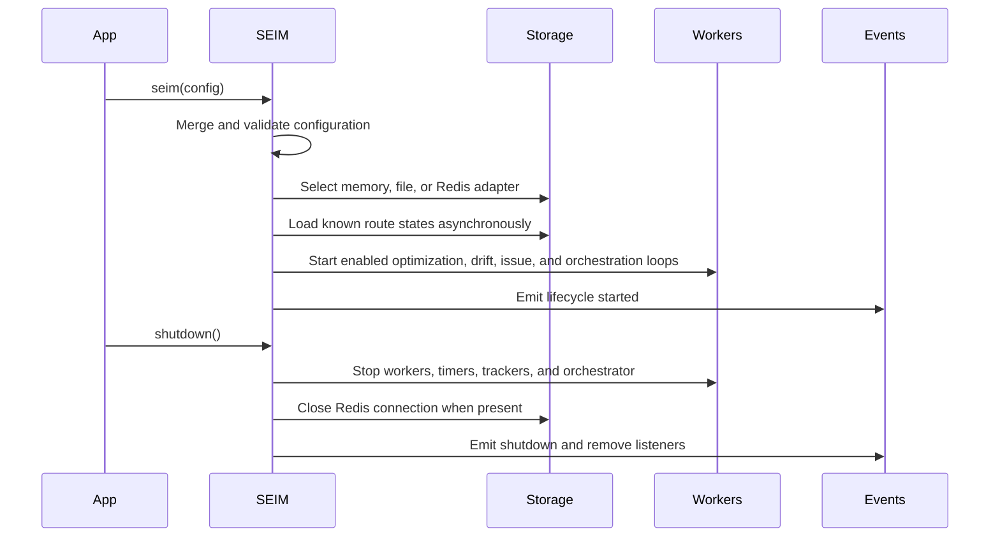

Applications should always await `shutdown()` during graceful termination. Construction currently starts enabled workers immediately; there is no separate public `start()` phase.

## Failure containment

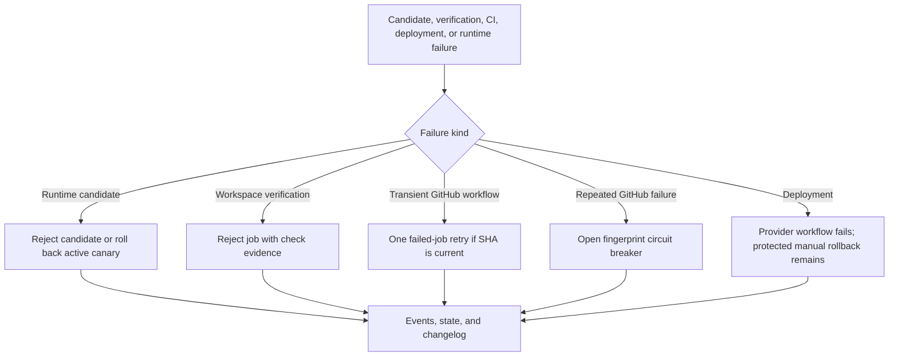

## Current implementation boundary

SEIM currently provides a tested foundation for taking over a baseline React/Next plus Node repository through bounded goals, verified pull requests, protected GitHub delivery, and a repair feedback loop. It does not yet prove unattended operation for arbitrary applications or all change categories.

The most important remaining production validations are:

- live integration tests against an actual Redis service and a multi-process deployment;
- live GitHub App, protected-branch, webhook, Vercel, AWS OIDC/ECR/ECS, and rollback drills;
- an externally isolated engineer worker for executing repository commands;
- project-specific browser, integration, security, migration, and acceptance tests;
- central persistence for runtime metrics, candidates, artifacts, learning, and changelog when running multiple replicas;
- broader planners for data migrations, authentication, billing, operations, and arbitrary cross-cutting refactors.

Those are explicit operational boundaries, not hidden fallbacks. SEIM's safety model is to stop, reject, or request approval when its current planner or verification contract cannot establish a safe change.
